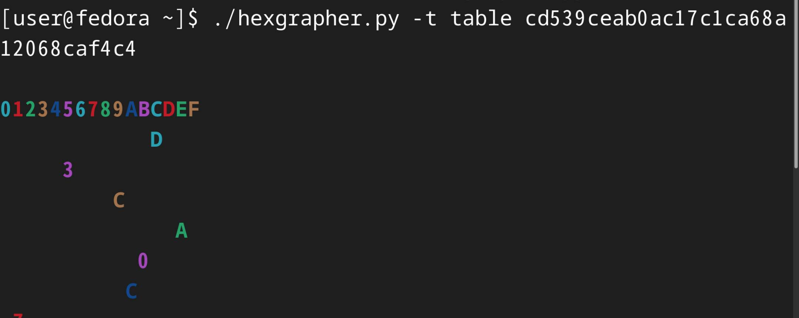
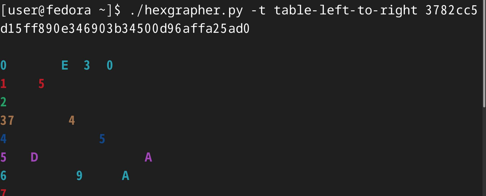
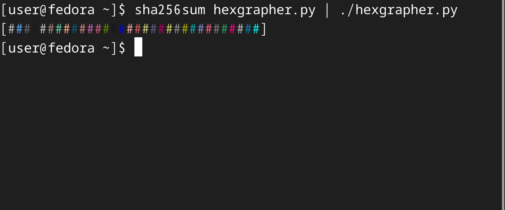

# Hexgrapher

This is a hex-data visualizer. It turns hexadecimal data into graphs and tables that with colors, which might be useful when you need to verify check-sums with bare eyes.







### Usage

This requires Python. (3.3 or later is recommended, while 2.7 is also supported.)

The input data can be given as an argument. For example:
```sh
python ./hexgrapher.py 3782cc5d15ff890e346903b34500d96affa25ad0
```

If not given, this program reads `stdin`.

For advanced usages, see `./hexgrapher.py --help`.
